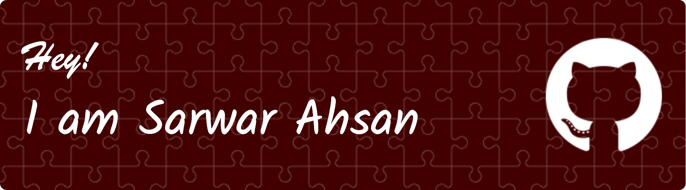

###

🔒 Cybersecurity Enthusiast | 🌐 Web Developer 👨‍💻 I'm passionate about cybersecurity and actively learning through certification courses. My interests also extend to machine learning, where I've explored libraries like pandas, scikit-learn, and matplotlib.  🎮 In addition to my technical pursuits, I enjoy creating fun board games and have experience in web development.  🛠️ My project portfolio includes working with a variety of languages and technologies, including JavaScript, Python, Java Swing, and C. Check out one of my projects here.  📚 Always learning and looking to collaborate on interesting projects!

###

  

  

- 🌱 I’m currently learning **Node.js, React, Flask etc.**

- 📫 How to reach me **akibahsan03@gmail.com**
- 👨‍💻 All of my projects are available at **https://github.com/sahsan21**

  
  

 

<h3 align="left">Connect with me:</h3>

<h3 align="left">Languages and Tools:</h3>

<h3 align="left">Stars</h3>

&nbsp;

